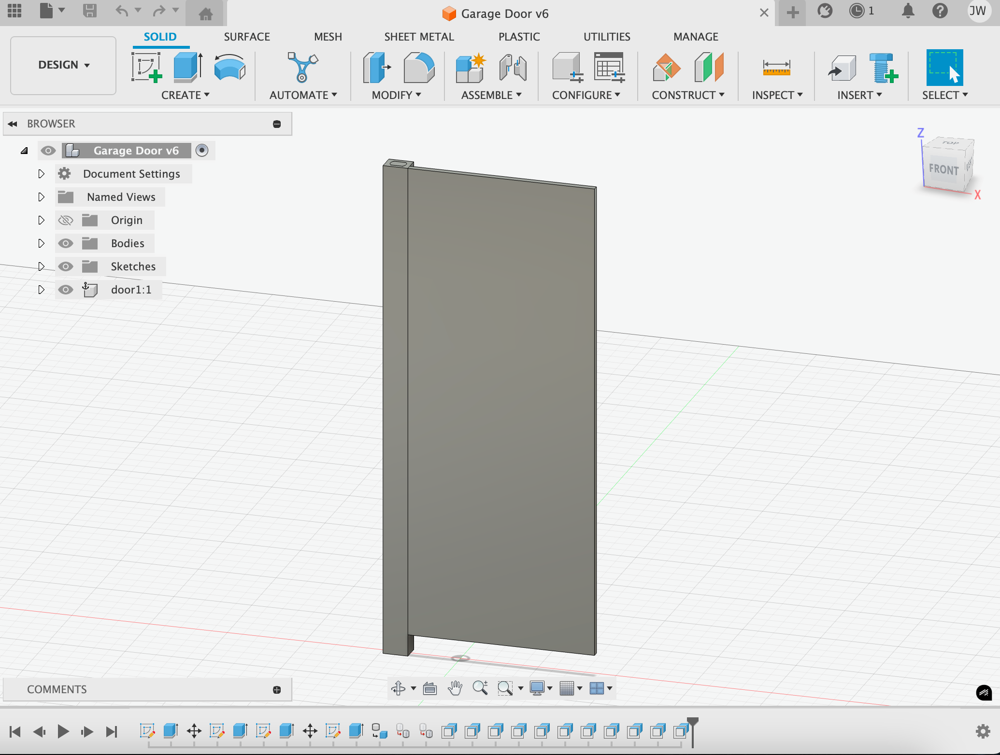

# Embedded Garage Door 🚪🤖  

An automatic smart garage door system powered by an STM32L4x6 ARM microcontroller, featuring remote Bluetooth control, real-time position tracking, and temperature-based automation.  

## Project Overview  

This project, developed by **Vincent Cheong** and **Jason Wang**, integrates embedded systems and communication protocols to create a smart garage door that can be remotely controlled via Bluetooth and responds dynamically to environmental conditions.  

## Images

## Features  

- **Remote Control via Bluetooth** 📲  
  - Uses a **HC-05 Bluetooth module** to allow users to open and close the garage door via an Android phone.  
  - Communicates with the STM32 microcontroller over **UART**.  

- **Real-Time Position Tracking** 📊  
  - Integrates an **ADXL345 accelerometer** using **SPI** to monitor and report door position and static acceleration via Termite.  

- **Temperature-Based Automation** 🌡️  
  - Uses a **TC74 temperature sensor** over **I2C** to enable smart control, adjusting the garage door’s position based on ambient temperature.  

- **Efficient Embedded Control** 🎛️  
  - Designed and implemented using **Embedded C** on an **STM32L4x6 ARM microcontroller** for precise motor control.  

## Technologies Used  

- **Programming Language**: Embedded C  
- **Microcontroller**: STM32L4x6 (ARM Cortex-M4)  
- **Communication Protocols**:  
  - **UART** (Bluetooth module communication)  
  - **SPI** (Accelerometer data transfer)  
  - **I2C** (Temperature sensor data transfer)  

## Hardware Components  

- STM32L4x6 ARM microcontroller  
- HC-05 Bluetooth module  
- ADXL345 accelerometer  
- TC74 temperature sensor  
- Servo motor for garage door rotation  

## How It Works  

1. The user sends an **open/close** command via a Bluetooth-connected Android phone.  
2. The STM32 microcontroller receives the command over **UART** and activates the **servo motor**.  
3. The **ADXL345 accelerometer** (SPI) provides real-time position updates.  
4. The **TC74 temperature sensor** (I2C) monitors the environment and can adjust the door position automatically.  

## Future Improvements  

- Add a **Wi-Fi module** for remote monitoring over the internet.  
- Implement a **mobile app** instead of relying on Termite for data visualization.  
- Enhance security features (e.g., **password-protected access**). 